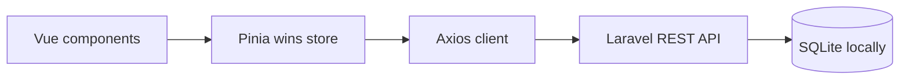
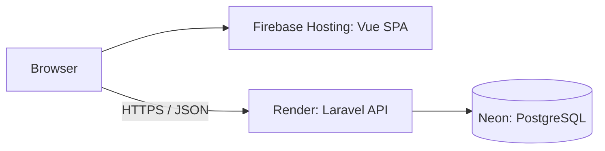

# Daily Wins Tracker

**Small progress matters.** A simple app for recording everyday victories: finishing an exercise, going to the gym, making time to learn, or starting a conversation.

Built with a Laravel REST API and a Vue 3 dashboard. The app supports creating, editing, deleting, searching and filtering wins, with a few useful progress statistics.

**Status:** the application works locally. Public deployment configuration and verified live links are the next steps in [PLAN.md](PLAN.md). This is a single-user portfolio demo with shared data and no authentication.

## Features

- Create and edit a win with a title, optional description, category and date.
- Delete a win after confirmation.
- Search titles and descriptions, combine search with a category filter, and clear filters.
- View total wins, wins this week and the current streak.
- See loading, empty, error and success states, with retries for failed requests.
- Keep form input after a failed save, show field validation, and prevent repeated submissions while saving.
- Use a responsive layout from 320px, labeled controls, visible keyboard focus and keyboard-accessible dialogs.

Categories: Career, Health, Social, Learning, Mindfulness, Personal and Other. Wins are ordered by date descending, then creation time descending. Dashboard statistics describe all wins, even while the list is filtered.

## Tech stack

| Layer | Tools |
| --- | --- |
| API | Laravel 13, PHP, Eloquent, Form Requests, JSON Resources |
| Frontend | Vue 3 Composition API, Vite 8 |
| State and HTTP | Pinia 4, Axios |
| Styling | Plain CSS, native HTML controls and dialogs |
| Local database | SQLite |
| Automated checks | PHPUnit 12 / Laravel Feature tests, Laravel Pint, Vite production build |
| Planned public database | PostgreSQL on Neon |

## Screenshots

Screenshots will be added after the public demo is deployed and verified.

| View | Screenshot status |
| --- | --- |
| Desktop dashboard | Pending |
| Mobile dashboard | Pending |
| Create / edit form | Pending |

## Architecture

The frontend and API are separate applications. Vue renders the interface; Pinia owns the shared state and API operations; Axios sends JSON requests to Laravel.



Laravel routes resolve to controllers. `SaveWinRequest` validates create/update payloads before the controller writes through Eloquent. `WinResource` provides the response shape, including the category and calendar date. `WinStatsService` calculates the dashboard statistics separately from the controller.

A category has many wins; each win belongs to one category. Migrations define the tables and foreign key. Seeders provide categories and sample entries.

```text
daily-wins/
├── backend/
│   ├── app/Http/Controllers/   # REST endpoints
│   ├── app/Http/Requests/      # Create/update validation
│   ├── app/Http/Resources/     # Win JSON shape
│   ├── app/Models/            # Win and Category relationships
│   ├── app/Services/          # Statistics and streak calculation
│   ├── database/             # Migrations, factories and seeders
│   ├── routes/api.php
│   └── tests/                # API and domain tests
├── frontend/
│   └── src/
│       ├── api/              # Configured Axios client
│       ├── components/       # Cards, filters, forms and dialogs
│       ├── stores/           # Pinia state and API operations
│       └── views/            # Dashboard orchestration
├── README.md
└── PLAN.md                   # Scope and one-iteration-per-commit workflow
```

## Local requirements

- Git.
- PHP **8.4.1 or newer** for the dependencies in `backend/composer.lock`; development was verified with PHP 8.5.11.
- PHP extensions required by Composer, plus `pdo_sqlite` for the local database. `composer check-platform-reqs` checks the installed packages' requirements.
- Composer 2.
- Node.js **22.12 or newer** and npm; development was verified with Node 24. Vite also supports Node 20.19 or newer within the 20.x release line.

SQLite is sufficient locally; no database server, Redis or queue worker is needed to use the tracker.

## Local installation

Clone the repository:

```bash
git clone https://github.com/mirkosoft108/daily-wins.git
cd daily-wins
```

### Backend

In the first terminal, starting from the repository root:

```bash
cd backend
composer install
composer check-platform-reqs
cp .env.example .env
php artisan key:generate
touch database/database.sqlite
php artisan migrate --seed
php artisan serve
```

The API runs at <http://localhost:8000/api>. Check it with:

```bash
curl -i http://localhost:8000/api/health
```

Expected result: HTTP 200 with `{"status":"ok"}`. This endpoint confirms the API responds; it does not check the database connection.

Seeding creates seven categories and eight sample wins dated relative to the first seed run. `php artisan db:seed` can add the demo data to an existing installation. The seeders use `firstOrCreate`: unchanged sample entries are preserved, and their dates do not advance on subsequent runs.

### Frontend

In a second terminal, starting from the repository root:

```bash
cd frontend
npm ci
cp .env.example .env
npm run dev
```

Open <http://localhost:5173>. Keep both servers running. To restart an existing installation, run only `php artisan serve` in `backend/` and `npm run dev` in `frontend/`.

The frontend defaults to `http://localhost:8000/api`. If the API uses a different port, update `frontend/.env` and restart Vite.

## Environment variables

Copy the committed examples into each application's own `.env`. Local `.env` files, database files, dependencies and generated assets are excluded from Git.

### Backend — `backend/.env`

| Variable | Local value / purpose |
| --- | --- |
| `APP_NAME` | `Daily Wins Tracker` |
| `APP_ENV` | `local` |
| `APP_KEY` | Generated by `php artisan key:generate`; the example is intentionally blank |
| `APP_DEBUG` | `true` locally; use `false` for the planned public deployment |
| `APP_URL` | `http://localhost:8000` |
| `DB_CONNECTION` | `sqlite` locally |
| `DB_DATABASE` | Leave unset for `backend/database/database.sqlite`; an absolute path can select another SQLite file |
| `LOG_CHANNEL` / `LOG_LEVEL` | `stack` / `debug` locally |
| `SESSION_DRIVER` / `CACHE_STORE` / `QUEUE_CONNECTION` | Laravel's local `database` defaults; tracker requests do not require a queue worker |

The Laravel application timezone is currently **UTC**, defined in `backend/config/app.php`. The PostgreSQL configuration already reads standard Laravel database variables; the production settings and hosting setup will be documented in iteration 8.

### Frontend — `frontend/.env`

| Variable | Local value / purpose |
| --- | --- |
| `VITE_API_BASE_URL` | `http://localhost:8000/api`, including the `/api` suffix |

Restart Vite after changing this value. For a production build, set it to the deployed API URL **before** running `npm run build`. Vite embeds these values in the browser bundle, so `VITE_` variables are public configuration.

## API

Base URL locally: `http://localhost:8000/api`. Requests and responses use JSON; clients should send `Accept: application/json` and use `Content-Type: application/json` for create/update requests.

| Method | Endpoint | Successful response |
| --- | --- | --- |
| GET | `/api/health` | 200, `{"status":"ok"}` |
| GET | `/api/categories` | 200, category array |
| GET | `/api/stats` | 200, statistics object |
| GET | `/api/wins` | 200, `{"data":[...]}` |
| POST | `/api/wins` | 201, `{"data":{...}}` |
| GET | `/api/wins/{win}` | 200, `{"data":{...}}` |
| PUT | `/api/wins/{win}` | 200, `{"data":{...}}` |
| DELETE | `/api/wins/{win}` | 204, empty body |

### Search and category filtering

`GET /api/wins` accepts optional `search` and `category` query parameters. Search matches titles and descriptions without case sensitivity; `category` is a category **slug**, such as `health`. Both filters can be combined:

```bash
curl 'http://localhost:8000/api/wins?search=gym&category=health'
```

Win responses include a nested category and a `YYYY-MM-DD` date:

```json
{
  "data": [
    {
      "id": 1,
      "title": "Went to the gym",
      "description": "Trained even though I felt tired.",
      "win_date": "2026-10-02",
      "category": { "id": 2, "name": "Health", "slug": "health" }
    }
  ]
}
```

The frontend waits 300ms after typing before searching, applies category changes immediately, and cancels superseded list requests.

### Create and update

Both POST and PUT require the same fields. Update sends the full form, including `description: null` to clear an existing description.

| Field | Validation |
| --- | --- |
| `title` | Required string, at most 120 characters |
| `description` | Optional nullable string |
| `category_id` | Required integer referring to an existing category |
| `win_date` | Required valid calendar date in `YYYY-MM-DD` format |

Example create request; use a category ID from `GET /api/categories`:

```bash
curl -i -X POST http://localhost:8000/api/wins \
  -H 'Content-Type: application/json' \
  -H 'Accept: application/json' \
  -d '{"title":"Finished an exercise","description":null,"category_id":4,"win_date":"2026-10-02"}'
```

Invalid payloads return **422** with Laravel's `message` and field-specific `errors`. Missing win IDs return **404**. The Vue form displays the field messages and keeps the draft available for correction or retry.

### Statistics and dates

`GET /api/stats` returns integer values:

```json
{ "total_wins": 48, "wins_this_week": 12, "current_streak": 7 }
```

- **Total wins:** all recorded wins.
- **This week:** win dates from Monday through Sunday of the current UTC calendar week.
- **Current streak:** consecutive calendar days ending today if there is a win today, otherwise yesterday. A missing day breaks the streak; several wins on one day count once; future dates do not extend it.

The form defaults to the browser's local date. Cards preserve the recorded calendar date when formatting it, so a timezone offset does not shift it to the previous day. Statistics use the API's UTC calendar boundaries.

After a successful create, edit or delete, Pinia reloads the filtered list and global statistics. Active filters remain in place, so a saved win may be hidden by them. If a refresh fails after a successful write, the write is still reported as successful and each failed read can be retried separately.

## Tests and build

From `backend/`:

```bash
php artisan test
vendor/bin/pint --test
```

The backend suite covers relationships and seeding, CRUD, payload validation, missing IDs, ordering, combined filters, and statistics including streak gaps, duplicate dates, future dates and week boundaries. `backend/phpunit.xml` selects an in-memory SQLite database for tests.

From `frontend/`:

```bash
npm run build
```

The output is written to `frontend/dist/` and is excluded from Git. To inspect the production bundle locally while Laravel is running:

```bash
npm run preview
```

Open the URL printed by Vite. The repository includes automated backend tests; use the following browser checks for the interface.

### Manual verification

1. Check the dashboard and form at 320, 375, 768 and desktop widths, including scrolling and long titles.
2. Search for `gym`, choose `Health`, clear the filters, and try a term with no matches.
3. Create a temporary win; edit its title, category, date and description; verify success feedback and statistics.
4. Open Delete, cancel once, then confirm. Check that the win disappears and the total updates.
5. Submit a blank title or category. Use Tab / Shift+Tab inside the dialog and Escape to cancel; check that focus returns to a dashboard control.
6. Use Network throttling to inspect loading states. Stop Laravel while a form is open, try saving, restart Laravel and retry with the retained input.

## Planned deployment architecture



| Service | Planned responsibility |
| --- | --- |
| [Firebase Hosting](https://firebase.google.com/docs/hosting) | Serve the compiled Vue application |
| [Render](https://render.com/docs/free) | Run the Laravel API in a Docker web service |
| [Neon](https://neon.com/docs/manage/endpoints/) | Persist the PostgreSQL database |

This is the planned public-demo setup; Docker, hosting configuration, production CORS and step-by-step deployment instructions belong to iteration 8. Live URLs and screenshots will be added after end-to-end verification.

The public demo is intended to use free-tier infrastructure and may have a **cold start**. Render's free web services sleep after inactivity; the first API request can take longer while the service wakes. The dashboard shows loading states and offers retry controls when a request fails. See [Render's free-service behavior](https://render.com/docs/free#spinning-down-on-idle).

## What this project demonstrates

| Area | Concrete example |
| --- | --- |
| REST API design and validation | [Routes](backend/routes/api.php), [WinController](backend/app/Http/Controllers/WinController.php), [SaveWinRequest](backend/app/Http/Requests/SaveWinRequest.php) and [WinResource](backend/app/Http/Resources/WinResource.php) |
| Relational modeling | [Win](backend/app/Models/Win.php), [Category](backend/app/Models/Category.php), [migrations and seeders](backend/database) |
| Isolated domain logic | [WinStatsService](backend/app/Services/WinStatsService.php) and [StatsTest](backend/tests/Feature/StatsTest.php) |
| Vue composition and shared state | [DashboardView](frontend/src/views/DashboardView.vue), [Pinia store](frontend/src/stores/wins.js) and [Axios client](frontend/src/api/http.js) |
| Form and interaction design | [WinForm](frontend/src/components/WinForm.vue), [AppModal](frontend/src/components/AppModal.vue), retries, confirmation and success feedback |
| Verification and reproducible setup | [API tests](backend/tests/Feature/WinsApiTest.php), lockfiles, environment examples and the checks above |

This repository is a focused Laravel and Vue portfolio project. It demonstrates the implementation shown here, with small, reviewable commits following [PLAN.md](PLAN.md).

## Scope and tradeoffs

The intended public demo shares one set of wins across visitors. Authentication, user accounts, permissions, uploads, queues and real-time features are outside v1. The list is unpaginated for the small demo dataset; statistics are computed on request. SQLite keeps local setup simple, while PostgreSQL is the planned deployment database.
